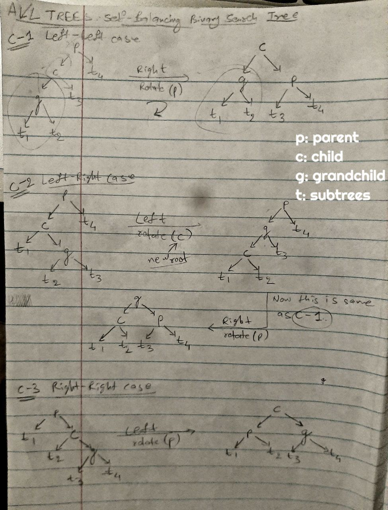
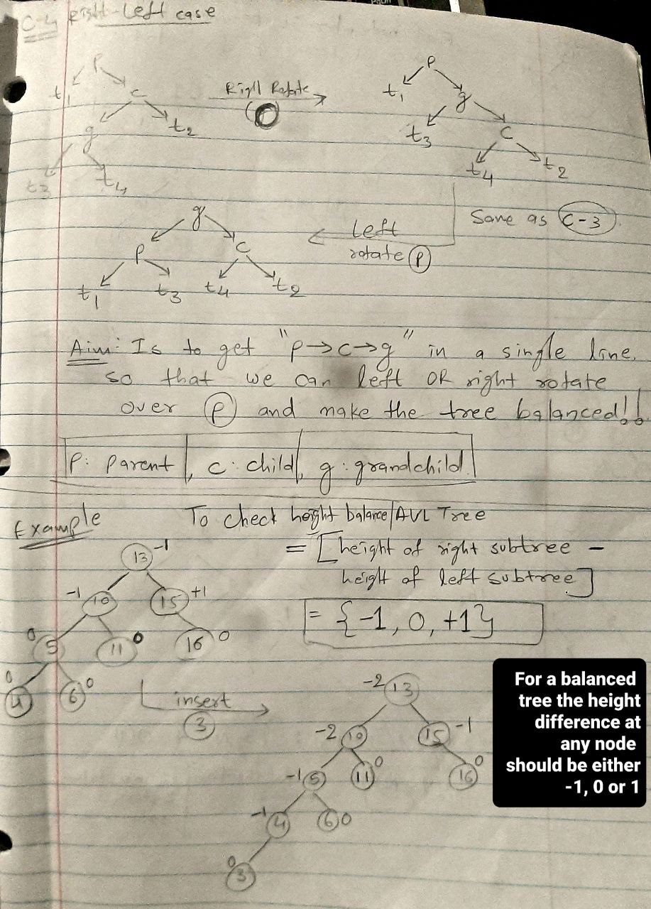
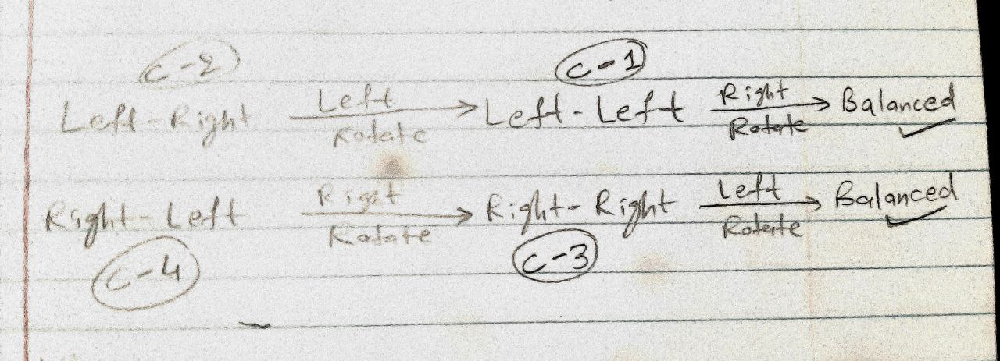
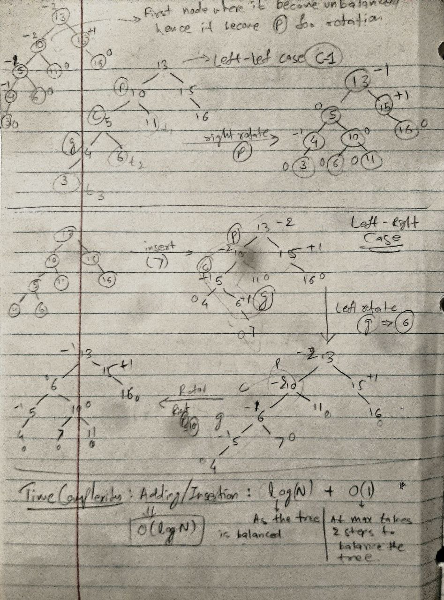

AVL trees are self-balancing binary search trees (BSTs) that automatically balance themselves during insertion and deletion operations. 
<br>This self-balancing property ensures that the height of the tree remains `logn`, given `n` is the no. of nodes in the tree, which helps maintain optimal search times.
<br>When the balance factor of a node (the difference between the heights of its left and right subtrees) becomes **unbalanced**, AVL trees perform specific rotation operations to restore balance.
There are 4 possible violations of the AVL tree's balance property:

1. Left-Left (LL) Case
2. Left-Right (LR) Case
3. Right-Right (RR) Case
4. Right-Left (RL) Case

In each case, an appropriate rotation (single or double) is applied to restore balance and maintain the binary search tree property. This ensures that the AVL tree remains efficient, with operations like search, insertion, and deletion performed in `O(logn)` time.

## Code rotate functions explained [[Code](https://github.com/AKR-2803/DSA-Declassified/blob/main/Notes/Trees/avl-trees.md#code)]

- First determine if the case is C-1, C-2 C-3 or C-4.
- Using the difference in heights of the subtrees, it is quite clear what case it is. 
- Interpreting this **ON PAPER**: Starting from bottom up, we calculate height differences of the nodes, the first node where we encounter a violation (i.e. the height difference is NOT -1, 0  or +1) becomes our `p`.
- And `c` is nothing but its child.\
  - `c = p.left` in C-1 & C-2, we perform right rotate. (Remember in C-2 we perform a left rotate first, to convert it into form of C-1. [Refer here](https://github.com/AKR-2803/DSA-Declassified/blob/main/Notes/Trees/avl-trees.md#interpreting-the-4-cases))
  - `c = p.right` in C-3 & C-4, we perform left rotate. ([Refer here](https://github.com/AKR-2803/DSA-Declassified/blob/main/Notes/Trees/avl-trees.md#interpreting-the-4-cases))
- As far as `leftRotate()` and `rightRotate()` functions are concerned, just see the cases on paper, it is quite easy to interpret how the chidren of nodes `p` and `c` are changing. And just code accordingly.(Refer the image and then code)

## Possible 4 Cases

| 4 Possible Cases for Rotation                                            |
  |--------------------------------------------------------------------------|
|  |
|  |


### Interpreting the 4 Cases

- **C-1 :** `left-left case -> right rotate -> Balanced Tree`
- **C-3 :** `right-right case -> left rotate -> Balanced Tree`
- The remaining two cases need a rotation prior to get themselves in the format of C-1 or C-3
- **C-2 :** `left-right case -> left rotate -> Becomes left-left (C-1) -> right rotate -> Balanced Tree`
- **C-4 :** `right-left case -> right rotate -> Becomes right-right (C-3) -> left rotate -> Balanced Tree`

|                                           |
  |--------------------------------------------------------------------|
|  |

| Example                                                                  |
  |--------------------------------------------------------------------------|
|  |

## Code 
- Only part necessary to understand the rotations is below.
- Refer [**full code here**](https://github.com/AKR-2803/DSA-Declassified/blob/main/Notes/Trees/AVL.java)


```java

class AVL {
    public AVL(){}
    public class Node {
        private int value;
        private int height;
        private Node left;
        private Node right;
        
        public Node(int value) {
            this.value = value;
        }

        public int getValue(Node node) {
            return value;
        }
    }

    private Node root;

    public int height(){
        return height(root);
    }

    private int height(Node node) {
        if (node == null) {
            return -1;
        }
        return node.height;
    }

    public void insert(int value) {
        root = insert(value, root);
    }

    private Node insert(int newValue, Node node) {
        if (node == null) {
            node = new Node(newValue);
            return node;
        }

        if (newValue < node.value) {
            node.left = insert(newValue, node.left);
        } else {
            node.right = insert(newValue, node.right);
        }

        // use the height() function to determine the height, it will return -1 in case the node is null
        node.height = Math.max(height(node.left), height(node.right)) + 1;

        // check for violation of balanced tree, everytime you insert a node
        // -----------------------  IMP  -----------------------
        return rotate(node);
    }

    // Part to understand the logic of self-balancing/rotations
    // Remember: height difference is `height of right subtree - height of left subtree`
    // height of a `null` node is `-1` (you defined it above, refer the code above)
    private Node rotate(Node node){
        // left heavy tree
        if(height(node.right) - height(node.left) < -1){
            // left-left case (C-1 => refer image)
            if(height(node.left.right) - height(node.left.left) < 0){
                return rightRotate(node);
            }

            // left-right case (C-2 => refer image)
            if(height(node.left.right) - height(node.left.left) > 0){
                // left rotate(c), then it becomes left-left case, fo right rotate(p)
                node.left = leftRotate(node.left);
                return rightRotate(node);
            }
        }

        // right heavy tree
        if(height(node.right) - height(node.left) > 1){
            // right-left case (C-4 => refer image)
            if(height(node.right.right) - height(node.right.left) < 0){
                node.right = rightRotate(node.right);
                return leftRotate(node);
            }

            // right-right case (C-3 => refer image)
            if(height(node.right.right) - height(node.right.left) > 0){
                // left rotate(p)
                return leftRotate(node);
            }
        }

        // if none of the above conditions occur, that means it is a balanced tree even after the insertion, hence simply return the node
        return node;
    }

    // refer `p` and `c`, from the images to relate and observe how the rotation occurs
    // C-3 (Right-Right) & C-4(Right-Left)
    private Node leftRotate(Node node) {
        Node p = node;
        Node c = p.right;

        Node temp = c.left;

        c.left = p;
        p.right = temp;

        p.height = Math.max(height(p.left), height(p.right)) + 1;
        c.height = Math.max(height(c.left), height(c.right)) + 1;

        // new/updated root of the subtree/tree after rotation
        return c;
    }
    
    // when the node is at `p.left` (C-1 & C-2)
    // In C-2 you can see after left rotate once, you get all three(p, c, g) aligned on the same line(kind of a linear path) on right
    // Now you can perform right rotate on that to make the tree balanced.
    private Node rightRotate(Node node) {
        Node p = node;
        Node c = p.left;

        Node temp = c.right;

        c.right = p;
        p.left = temp;

        p.height = Math.max(height(p.left), height(p.right)) + 1;
        c.height = Math.max(height(c.left), height(c.right)) + 1;

        // new/updated root of the subtree/tree after rotation
        return c;
    }
    

    public boolean balanced() {
        return balanced(root);
    }

    private boolean balanced(Node node) {
        if (node == null) {
            return true;
        }
        return Math.abs(height(node.left) - height(node.right)) <= 1 && balanced(node.left) && balanced(node.right);
    }
}
```