<!--  -->

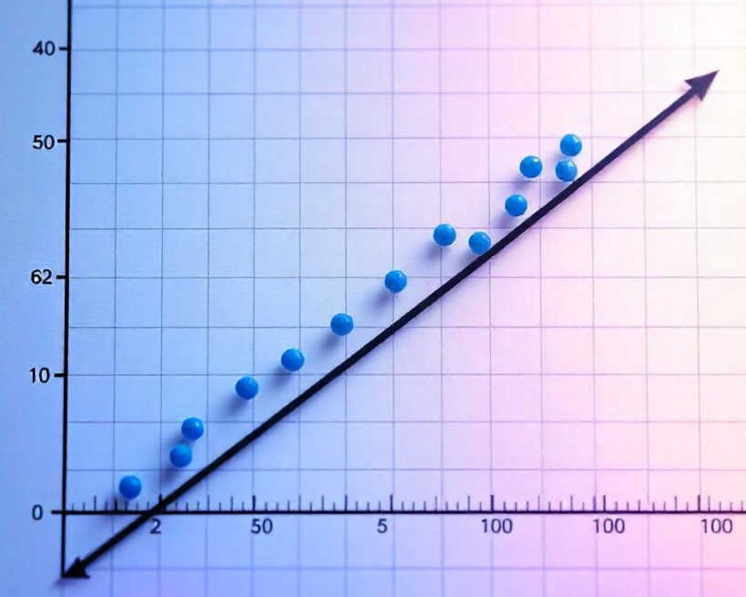

Image generated by <a href="https://www.freepik.com/ai/image-generator" target="_blank">FreePik</a>

Linear regression is one of the simplest and most commonly used tools in machine learning. At its core, it’s about finding the relationship between variables by drawing the best-fit line through a set of data points. While that might sound a bit technical, this article breaks it down in a way that’s easy to understand, without overwhelming you with complex math or confusing terms.

## Understanding Linear Regression
Let’s understand it using an example. Say you have an exam coming. Ideally, the more you study, the more you will score on the exam. Our goal is to predict exam score given the number of hours studied. Consider this:

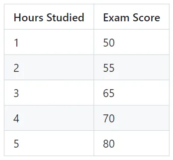

- How do we predict exam scores for, say, 6, 7, 8... hours studied?

- Let us try to plot the given data points. 

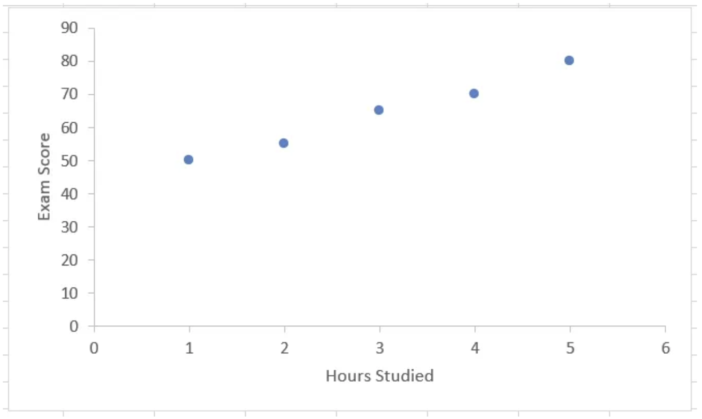

- It looks as if these points are following a linear pattern. But, are they? Let’s try to fit all these points on a straight line.

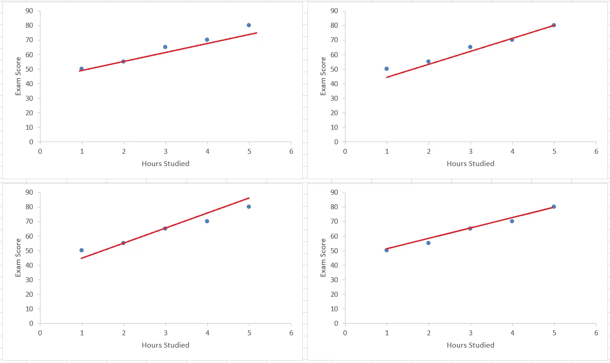

It is quite clear that we would not be able to fit all the points on a single line. What can we do then? Somehow find a way to plot a magical or “optimal” line. How do we decide what this magical line will be?

### Analyzing an Example
Take for example this line: 

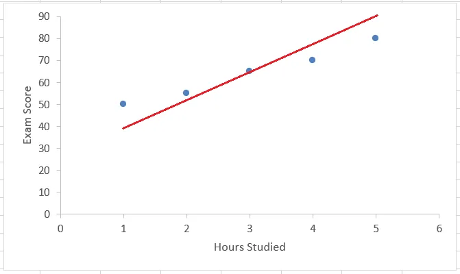

One point(`x=3`) falls on the line, but the others are at some distance from it. All the points falling on the line are predicted values and blue points are the actual values we got from the data.

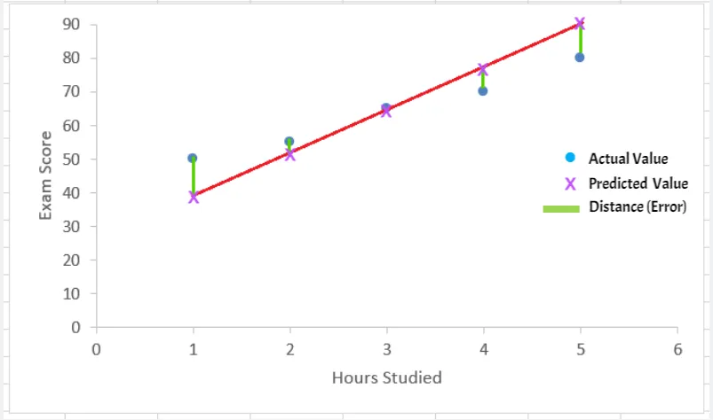

#### The Magical/Optimal Line

What can be the magical/optimal line?
- Some lines will have large distances from most points, while others will be much closer.
- The best line minimizes the total distance (errors) from all points.

**The distance between actual values (blue points) and predicted values (points on the line) is the error. Our goal is to minimize this distance `error`**.

### Calculating Distance

Our goal is to minimize this distance(error). Let the distances from the points be `d1` to `d5`.

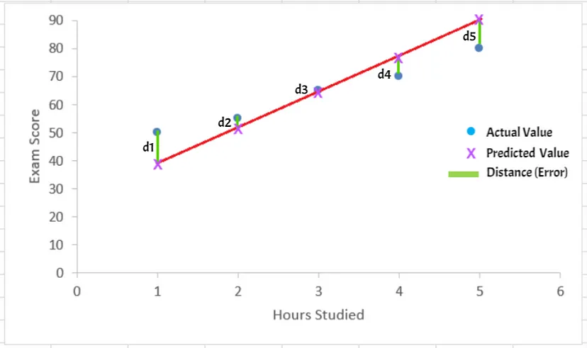

We can find the any distance `d` as

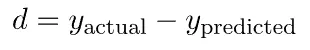
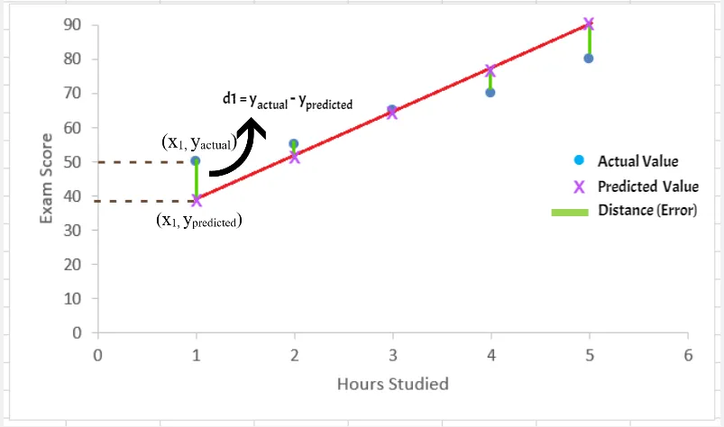

These distances are nothing but the errors, hence we can say

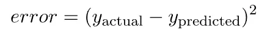

#### Why Square the Error?
- Errors can be positive or negative. Squaring the errors ensures that all errors are positive, so they don’t cancel each other out.
- The sum of squared errors is differentiable, meaning we can use calculus to find the values of the slope and intercept of the straight line that minimize the total error.
- Using absolute errors (just taking them as they are) would lead to a more complex optimization problem that's harder to solve analytically.
- All in all, it makes our lives easier.

### Mean Squared Error (MSE)

- For each point, we calculate the squared error. Following this, we sum all these squared errors. And then take the mean (average) of them, i.e. Mean Squared Error. Consider we have `n` data points, then:

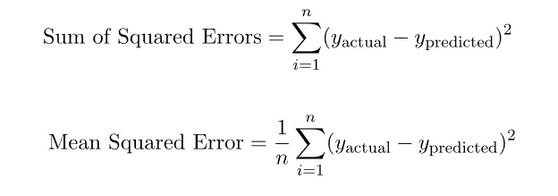

where `y actual` and `y predicted` are usually denoted as

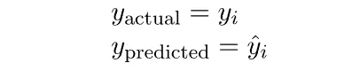

- `yi`​ is the actual value for the ith data point.
- `ŷi` is the predicted value for the ith data point.

Hence, we may rewrite Mean Squared Error (MSE) as

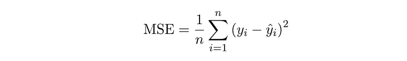

> The **distance between actual values** (blue points) and **predicted values** (points on the line) is the **error**. Our goal is to minimize this distance (error).
{: .prompt-info }

### Cost Function
A function that measures the total “cost” OR total “error”. The Mean Squared Error above is itself a cost function. It is also represented using J. The cost function can be written as:

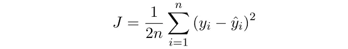

Sometimes a factor of **`1/2`** is included so that further calculations become neater. However, even if this factor is not considered the cost function works just fine.

### Optimization
**Our goal** in linear regression is to minimize the error, which means **minimizing this cost function**. This process involves calculus, particularly taking partial derivatives of the cost function with respect to the model parameters. This is the core of the **Gradient Descent Algorithm**, a widely used optimization method for minimizing the cost function.

## Final Thoughts

This article introduced linear regression without diving into complex mathematical jargon. In a future article, I will discuss advanced topics like the gradient descent algorithm.However, the aim of this article is to provide an overview of linear regression without diving into complex mathematical jargon. Therefore, we will not explore the detailed calculus behind the approach here. Soon, I will share a link to another article where I breakdown linear regression further, including concepts like gradient descent algorithm.

---

### Thank You for Reading!
- I hope this article helped you understand the approach to linear regression and got you started on the right path.
- Any feedback on this article is appreciated, I would love to hear from you on how I can improve.
- In the meantime, feel free to connect with me on my socials here: [LinkedIn](https://www.linkedin.com/in/aaryaveer-rajput/) [GitHub](https://github.com/AKR-2803)

