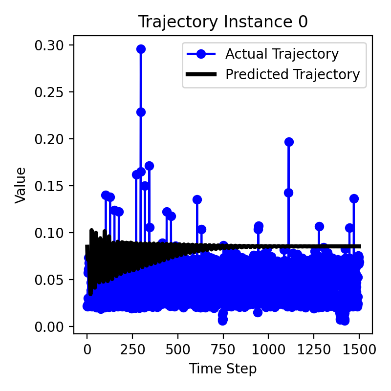
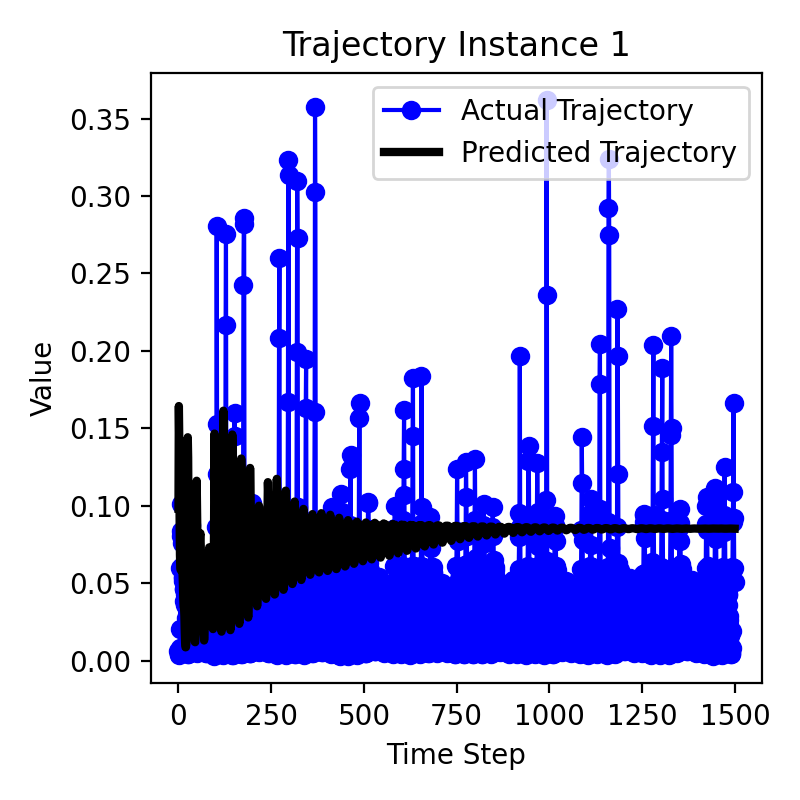
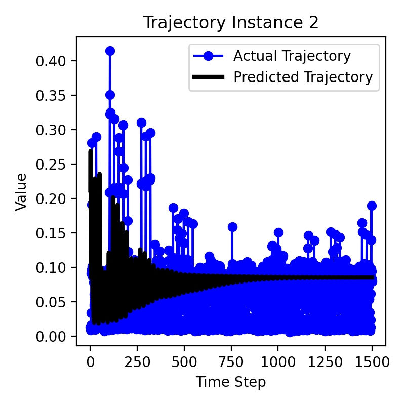
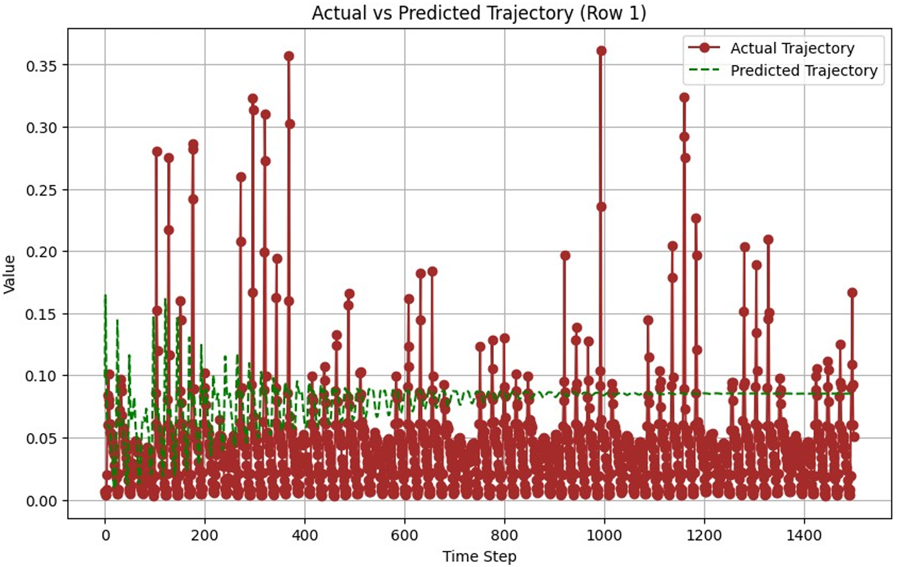

<p align="center">Image generated by <a href="https://chat.openai.com/" target="_blank">ChatGPT</a></p>

[This repository](https://github.com/AKR-2803/pytorch-time-series-forecasting) demonstrates time series forecasting using a Long Short-Term Memory (LSTM) model. The main objective is to predict future trajectories based on historical data.

### 🛠 How to Set Up and Replicate

1. Clone the Repository:
   
   ```bash  
   git clone https://github.com/AKR-2803/pytorch-time-series-forecasting
   cd pytorch-time-series-forecasting
   ```

2. Install required dependencies: You can install all the necessary dependencies using the `requirements.txt` file:
   
   ```bash
   pip install -r requirements.txt
   ```

3. **Dataset**: The dataset can be downloaded from [here](https://drive.google.com/file/d/1yYLXskgFGxi2CSMynAEX6-peN2i0_YxQ/view?usp=sharing)

4. When trying to run `model.ipynb` locally, replace this

    ```python
    import os
    train_path = os.path.join("/kaggle/input/cse-575-project-2/train.csv")
    val_path = os.path.join("/kaggle/input/cse-575-project-2/val.csv")
    test_path = os.path.join("/kaggle/input/cse-575-project-2/test.csv")

    train_df = pd.read_csv(train_path, header=0).drop('ids', axis=1)
    val_df = pd.read_csv(val_path, header=0).drop('ids', axis=1)
    test_df = pd.read_csv(test_path, header=0).drop('ids', axis=1)
    ```

    with 

    ```python
    train_path = "dataset/train.csv"
    val_path = "dataset/val.csv"
    test_path = "dataset/test.csv"

    train_df = pd.read_csv(train_path, header=0).drop('ids', axis=1)
    val_df = pd.read_csv(val_path, header=0).drop('ids', axis=1)
    test_df = pd.read_csv(test_path, header=0).drop('ids', axis=1)
    ```

    Make sure to replace all file paths, such as `"dataset/train.csv"`, with your appropriate system paths.

5. Ensure the `dataset` (containing `train.csv`, `val.csv`, and `test.csv`) folder is placed in the same directory as `model.ipynb`. This ensures the code can correctly locate the files when executed locally.

### Output

The following output images display the results of the LSTM model's predictions on the first three trajectory instances:

| 1 | 2 | 3 | 
| ------------------ | ------------------ | ------------------ | 
|   |   |   |

#### Output trajectory for Row-1:

<kbd>

</kbd>
