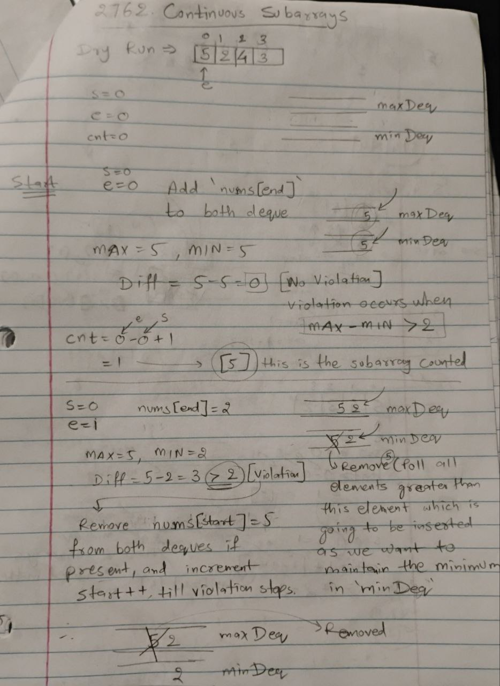
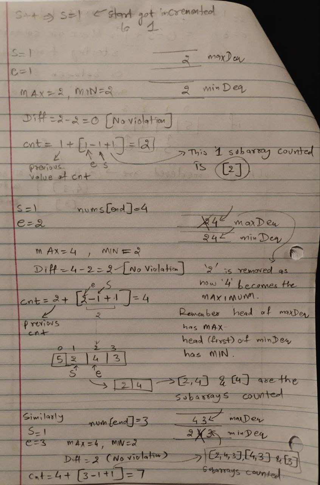
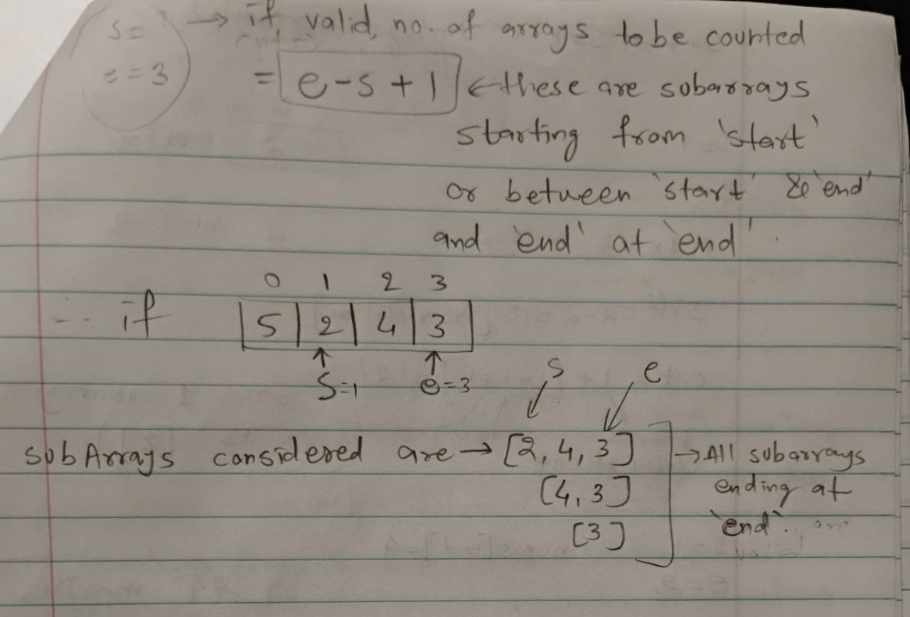

___

## [[Problem](https://leetcode.com/problems/continuous-subarrays/description/)][[Code](https://github.com/AKR-2803/DSA-Declassified/blob/main/POTD-Leetcode/December/code/ContinuousSubarrays.java)]

<!-- <div style="text-align:left;display:inline;">  </div> -->

<div style="text-align:left;display:inline;">  </div>

<!-- <div style="text-align:left;display:inline;">  </div> -->

[**_`Array`_**](https://leetcode.com/problem-list/array/) [**_`Queue`_**](https://leetcode.com/problem-list/queue/) [**_`Sliding Window`_**](https://leetcode.com/problem-list/sliding-window/) [**_`Heap(PriorityQueue)`_**](https://leetcode.com/problem-list/heap-priority-queue/) [**_`Ordered Set`_**](https://leetcode.com/problem-list/ordered-set/) [**_`Monotonic Queue`_**](https://leetcode.com/problem-list/monotonic-queue/)

## Approach

### 1. Brute-Force

- The obvious brute-force approach is simple, check all subarrays if they satisfy the condition
- But total subarrays in an `n-sized` array are `n*(n+1)/2`, which is order of `O(n^2)`. 
- Moreover you iterate through each of them to find whether they are continuous or not.
- This brings the time complexity in order of `O(n^3)`, which is exactly why TLE (Time Limit Exceeded) occurs in leetcode (2129/2135 case).

Here's the code for the brute-force approach:

```java
// Not preferable O(n^3) solution
class Solution {
    public long continuousSubarrays(int[] nums) {
        int n = nums.length;    
        long count = 0;

        // this approach will take O(n^3) time, hence TLE will occur
        int start = 0;
        for(int end = 0; end < n; end++){
            while(!isCont(nums, start, end)){
                start++;
            }
            count += end - start + 1; // count total valid subarrays for given `start` and `end` pointers
        }

        return count;
    }

    // function to iterate thorugh a subarray to check if it is continuous or not
    public boolean isCont(int[] nums, int start, int end){
        for(int i = start; i <= end; i++){
            for(int j = i + 1; j <= end; j++){
                int diff = Math.abs(nums[i] - nums[j]);
                if(diff > 2){
                    return false;   // condition for continuous array violated
                }
            }
        }
        return true;
    }
}
```
___

### 2.  A better-approach: Sliding Window with Deque

We utilize a **sliding window** technique with the help of two **deques**:
- `maxDeq`: Maintains the maximum values in the current sliding window.
- `minDeq`: Maintains the minimum values in the current sliding window.

#### Steps:

-  **Iterate with a sliding window (`end` pointer):**
   - Expand the window by adding `nums[end]` to both `maxDeq` and `minDeq`.

-  **Maintain Monotonic Deques:**
   - `maxDeq`: Ensure elements are in **decreasing order** by removing smaller elements from the back.
   - `minDeq`: Ensure elements are in **increasing order** by removing larger elements from the back.

- **Validate the Window:**
   - The difference between the maximum (`maxDeq.peekFirst()`) and minimum (`minDeq.peekFirst()`) values should not exceed `2`.
   - If the condition is violated, shrink the window by incrementing the `start` pointer and removing the corresponding values from the deques.

- **Count Valid Subarrays:**
   - For each valid window, the number of subarrays ending at index `end` is given by: `end - start + 1`

- **Return Total Count:**
   - Add `count` from all valid windows.

___

### Complexity Analysis

- **Time Complexity:**
   - Each element is added and removed from the deques at most once, hence `O(n)`

- **Space Complexity:**
   - The two deques require `O(n)` space in the worst case.


### Reference Images

| Dry run example [5,2,4,3]                                                             | 
|--------------------------------------------------------------------------------------| 
|  |
|  |
|  |

### [Code](https://github.com/AKR-2803/DSA-Declassified/blob/main/POTD-Leetcode/December/code/ContinuousSubarrays.java)

```java
class Solution {
    public long continuousSubarrays(int[] nums) {
        int n = nums.length;
        long cnt = 0;
        
        // Two deques to maintain the maximum and minimum values in the current window
        Deque<Integer> maxDeq = new LinkedList<>();
        Deque<Integer> minDeq = new LinkedList<>();

        int start = 0;

        // Iterate through the array with the `end` pointer
        for(int end = 0; end < n; end++){
            // Maintain decreasing order in maxDeq
            while(!maxDeq.isEmpty() && nums[end] > maxDeq.peekLast()){
                maxDeq.pollLast();
            }

            // Maintain increasing order in minDeq
            while(!minDeq.isEmpty() && nums[end] < minDeq.peekLast()){
                minDeq.pollLast();
            }

            // Add current element to both deques
            maxDeq.offerLast(nums[end]);
            minDeq.offerLast(nums[end]);

            // while the continuous array conditions are violated
            // keep shrinking the window from left, i.e. increment `start`
            while(maxDeq.peekFirst() - minDeq.peekFirst() > 2){
                if(nums[start] == maxDeq.peekFirst()){
                    maxDeq.pollFirst();
                }

                if(nums[start] == minDeq.peekFirst()){
                    minDeq.pollFirst();
                }

                start++;
            }

            // for valid subarray, count all possible subarrays
            // these are all subarrays ending at `end` and starting between `start` and `end` are valid
            cnt += end - start + 1;
        }
        return cnt;
    }
}
```