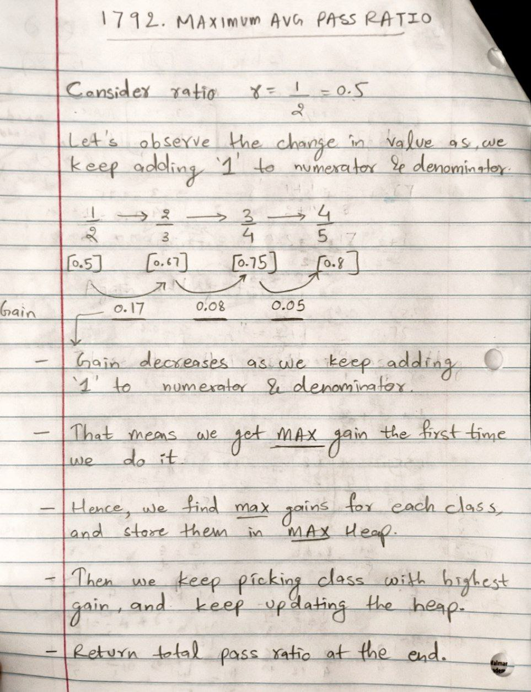

___

## [[Problem](https://leetcode.com/problems/maximum-average-pass-ratio/description/)][[Code](https://github.com/AKR-2803/DSA-Declassified/blob/main/POTD-Leetcode/December/code/MaxAvgPassRatio.java)]


<!-- <div style="text-align:left;display:inline;">  </div> -->

<div style="text-align:left;display:inline;">  </div>

<!-- <div style="text-align:left;display:inline;">  </div> -->

[**_`Array`_**](https://leetcode.com/problem-list/array/) [**_`Greedy`_**](https://leetcode.com/problem-list/greedy/) [**_`Heap (Priority Queue)`_**](https://leetcode.com/problem-list/heap-priority-queue/)

## Intuition

- When adding extra students to a class, the first student has the **highest impact on the pass ratio**. 
- Each subsequent student has a diminishing effect on the improvement of the pass ratio. 
- This is because as the total number of students increases, the gain from adding one more student decreases. 
- [Refer Image](https://github.com/AKR-2803/DSA-Declassified/blob/main/POTD-Leetcode/December/12-15-2024-max-avg-pass-ratio.md#reference-image) for more clarity on this

## Approach

###  Priority Queue or MAX Heap

-  **Initialize a Max Heap**
    - Calculate the initial gain for each class when adding one extra passing student (max gain for that class, thereafter gains will diminish) 
    - Store the classes values along with these gains
    - Sort the heap according to gain

    - Let us see how this works in `Java`
    ```java
    PriorityQueue<double[]> heap = new PriorityQueue<>((a, b) -> Double.compare(b[0], a[0]));
    ```
    - `PriorityQueue` in Java is by default a **MIN-heap**
    - We cannot do something like `b[0] - a[0]` in the comparator, as it expects `int` values, so we instead use `Double.compare`
    - `Double.compare(b[0], a[0])` This is a custom comparator which changes(reverses) the default behavior
    - This compares b[0] with a[0] in reverse order.
    - I.E. If `b[0] > a[0]`, it returns a negative value, which makes `b[0]` come before `a[0]`
    - More on [**Double.Compare()**](https://docs.oracle.com/javase/8/docs/api/java/lang/Double.html#compare-double-double-)
    - This will hence create a **MAX-Heap**, where elements are sorted in descending order by `b[0]` which is the `gain`

-   **Now distribute the extra students one by one** 
    - Remove(poll()) max gain class from heap(top of the heap)
    - Calculate the new gain
    - Update the gain and push the class back into the heap

-   **Simply calculate and return the final pass ratio**

___

### Complexity Analysis

- **Time Complexity: _O((n+e)logn)_**
   - Adding classes to Heap: Each class taken `O(logn)` time to add in the heap, there are `n` classes = `O(nlogn)` time.
   - For each extra student, we remove and insert a value from the heap, which takes `O(logn)` time
   - Assuming `e` total `extraStudents`, time = `O(elogn)`
   - Calculating final pass ratio (traverse through heap once) : `O(n)`

   - Total TC : `O(nlogn) + O(elogn) + O(n)` => which simplifies to => `O((n + e)logn)`

- **Space Complexity: _O(n)_**
   - Heap stores `n` elements for n classes, hence `O(n)`.

### Reference Image

| Understanding diminishing effect on gain                                             | 
|--------------------------------------------------------------------------------------| 
|  |

### [Code](https://github.com/AKR-2803/DSA-Declassified/blob/main/POTD-Leetcode/December/code/MaxAvgPassRatio.java)

```java
class Solution {
    public double maxAverageRatio(int[][] classes, int extraStudents) {
        PriorityQueue<double[]> heap = new PriorityQueue<>((a, b) -> Double.compare(b[0], a[0]));

        // store `max gain ratio` in the max heap
        // one that has max gain after adding 1 student will be at the top
        for(int[] c : classes){
            double pass = c[0];
            double total = c[1];
            double currentGain = (pass + 1) / (total + 1) - (pass / total);

            // heap will maintain 
            heap.offer(new double[]{currentGain, pass, total});
        }

        // keep adding extraStudent 1 by 1
        for(int i = 0; i < extraStudents; i++){
            // keep choiosing the top for max gain
            double[] top = heap.poll();
            double passI = top[1] + 1;
            double totalI = top[2] + 1;

            double newGain = (passI + 1) / (totalI + 1) - (passI / totalI);
            
            // send the updated gain for this class back to the max heap
            heap.offer(new double[]{newGain, passI, totalI});
        }

        // now calculate total pass ratio for all classes
        double totalRatio = 0.0;

        // simply take the pass ratios of each class
        for(double[] c: heap){
            totalRatio += c[1] / c[2];
        }
        return totalRatio / classes.length;
    }
}
```