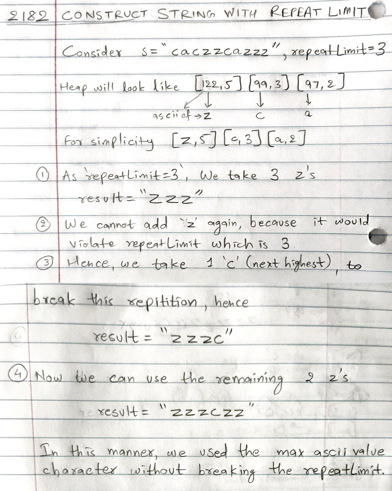

# POTD 12-17-2024


## 2182. Construct String With Repeat Limit [[Problem](https://leetcode.com/problems/construct-string-with-repeat-limit/description/)][[Code](https://github.com/AKR-2803/DSA-Declassified/blob/main/POTD-Leetcode/December/code/ConstructStringWithRepeatLimit.java)]

 <!--   -->
  
<!--  -->

#### **Tags:** [`Hash Table`](https://leetcode.com/tag/hash-table/) [`String`](https://leetcode.com/tag/string/) [`Greedy`](https://leetcode.com/tag/greedy/) [`Heap(Priority Queue)`](https://leetcode.com/tag/heap-priority-queue/) [`Counting`](https://leetcode.com/tag/counting/)

## Intuition
- The problem requires constructing a string such that no character repeats more than a given `repeatLimit` consecutively. 
- To achieve this, we prioritize characters with higher lexicographical values(ascii values) and use alternate characters when necessary to break the repetition.

## Approach
- **Count Frequencies**: Use a `HashMap` to count the occurrences of each character in the input string.
- **Max Heap**: Use a max heap (PriorityQueue) to store characters based on their ASCII values in descending order.
- **Calculate the result**:
   - Extract the most frequent character(poll from heap).
   - Append it up to the `repeatLimit` or its remaining count.
   - If the character still has more occurrences, check for an alternate character to break the repetition.
   - Reinsert both the current character (if occurrences remain) and the alternate character into the heap.
   - [Refer Image](https://github.com/AKR-2803/DSA-Declassified/blob/main/POTD-Leetcode/December/12-17-2024-construct-string-with-repeat-limit.md#reference-image) and the code below to understand main logic behind the approach.
```java
if(count > addLimit){
    // no character to break the `repeatLimit`
    // at this point we exhausted the current `max` character (say we had 5 z's and 
    // `repeatLimit=3`, we can add 3 z's, but then need a different character to not 
    // violate the repeatLimit, hence we add 1 alternate character(next highest in the order) 
    // following which we can add the remaining 2 z's)
    // hence we check if there is any other character in the heap that comes after `z`
    // in lexicographical order(lesser ascii value)
    // remember we `polled`=removed the max character(character with highest ascii 
    // value) at this point, hence if there is no other character to break the 
    // repitition, we are done, and cannot do better than this
    if(maxHeap.isEmpty()){
        break;
    }

    // otherwise, we have an alternate, then take `1` of those characters
    int[] next = maxHeap.poll();
    result.append((char) next[0]);

    // if after taking one of them we still have these characters left, 
    // add them back to the heap
    if(--next[1] > 0){
        maxHeap.offer(next);
    }

    // finally, add the max character back into the heap, with updated count
    maxHeap.offer(new int[] {ascii, count - addLimit});
}
```
- Repeat until no valid characters are left, return the result.
___
### Complexity Analysis
- **Time Complexity: _O(nlogk)_** 
    - `n` is the length of the string
    - `k` is the no. of unique characters
    - `O(logk)` for heap operations.
- **Space Complexity: _O(k)_**

### Reference Image
| Logic behind the approach                                             | 
|--------------------------------------------------------------------------------------| 
|  |


### [Full Code](https://github.com/AKR-2803/DSA-Declassified/blob/main/POTD-Leetcode/December/code/ConstructStringWithRepeatLimit.java)

```java
class Solution {
    public String repeatLimitedString(String s, int repeatLimit) {
        Map<Integer, Integer> mp = new HashMap<>();

        // Count occurrences of each character.
        for (int i = 0; i < s.length(); i++) {
            int asc = (int) s.charAt(i);
            mp.put(asc, mp.getOrDefault(asc, 0) + 1);
        }

        // Max-heap to store characters in descending lexicographical order.
        PriorityQueue<int[]> maxHeap = new PriorityQueue<>((a, b) -> b[0] - a[0]);

        // Push [ascii, count] into the heap.
        for (Map.Entry<Integer, Integer> entry : mp.entrySet()) {
            maxHeap.offer(new int[] {entry.getKey(), entry.getValue()});
        }

        StringBuilder result = new StringBuilder();

        while (!maxHeap.isEmpty()) {
            int[] current = maxHeap.poll();
            int ascii = current[0], count = current[1];

            // Add up to 'repeatLimit' instances of the current character.
            int addLimit = Math.min(count, repeatLimit);
            for (int i = 0; i < addLimit; i++) {
                result.append((char) ascii);
            }

            // If characters remain, check for an alternate character, to not violate the `repeatLimit`
            if (count > addLimit) {
                if (maxHeap.isEmpty()) break; // No other character available.

                int[] next = maxHeap.poll();  // Use one instance of the next character.
                result.append((char) next[0]);
                
                // Return the next character to the heap if it still has occurrences.
                if (--next[1] > 0) {
                    maxHeap.offer(next);
                }

                // Reinsert the current character with remaining count.
                maxHeap.offer(new int[] {ascii, count - addLimit});
            }
        }
        return result.toString();
    }
}
```