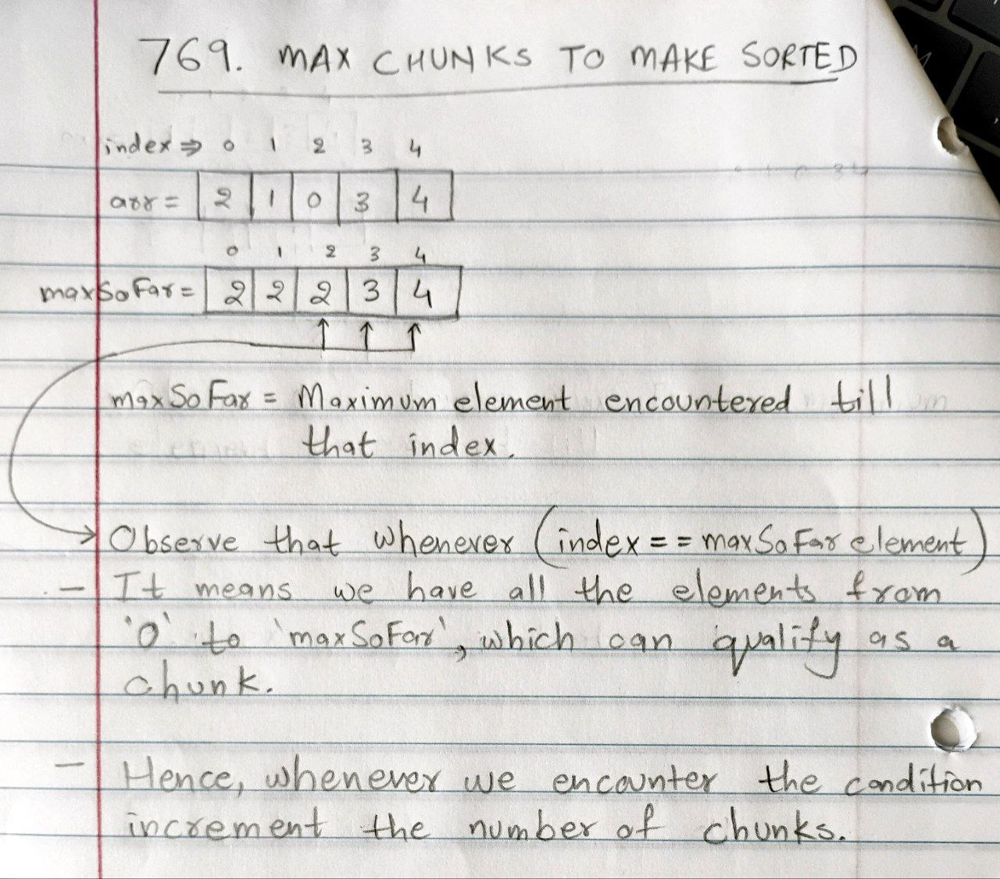

# POTD 12-19-2024

## 769. Max Chunks To Make Sorted [[Problem](https://leetcode.com/problems/max-chunks-to-make-sorted/description/)][[Code](https://github.com/AKR-2803/DSA-Declassified/blob/main/POTD-Leetcode/December/code/MaxChunksToMakeSorted.java)]

 <!--   -->
  
<!--  -->

#### **Tags:** [`Array`](https://leetcode.com/problem-list/array/) [`Stack`](https://leetcode.com/problem-list/stack/) [`Greedy`](https://leetcode.com/problem-list/greedy/) [`Sorting`](https://leetcode.com/problem-list/sorting/) [`Monotonic Stack`](https://leetcode.com/problem-list/monotonic-stack/)

## Intuition  
- The key observation is that a chunk can end at index `i` if the maximum value encountered so far (`maxSoFar`) is equal to `i`. 
- This ensures all values in the chunk are valid for their positions in the sorted array.  

## Approach  

- `maxSoFar`: Tracks the maximum value seen so far in the array.  
- `cnt`: Counter to store the number of valid chunks.  

- For each index `i`:  
    - Update `maxSoFar` as the maximum of `maxSoFar` and `arr[i]`.  
    - Check if `maxSoFar` equals `i`. If true, increment the chunk counter (`cnt`).  

- Return `cnt`

### Complexity Analysis
- **Time Complexity: _O(n)_**  

- **Space Complexity: _O(1)_**

### Reference Image
| Logic behind the approach                                             | 
|--------------------------------------------------------------------------------------| 
|  |

#### [Code](https://github.com/AKR-2803/DSA-Declassified/blob/main/POTD-Leetcode/December/code/MaxChunksToMakeSorted.java)
```java
class Solution { 
    public int maxChunksToSorted(int[] arr) {
        int n = arr.length;
        int maxSoFar = 0;
        int cnt = 0;

        for(int i = 0; i < n; i++){
            maxSoFar = Math.max(maxSoFar, arr[i]);

            if(maxSoFar == i){
                cnt += 1;
            }
        }

        return cnt;
    }
}
```