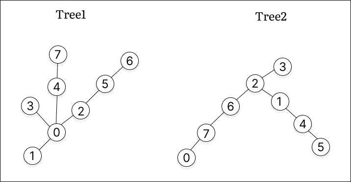
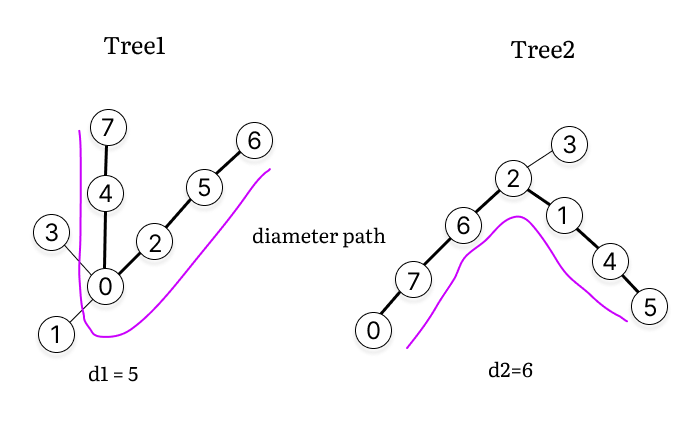
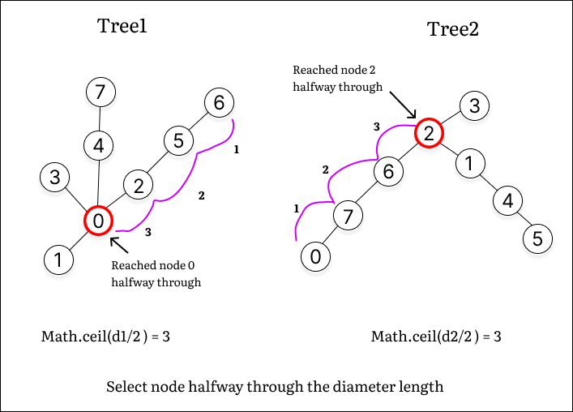
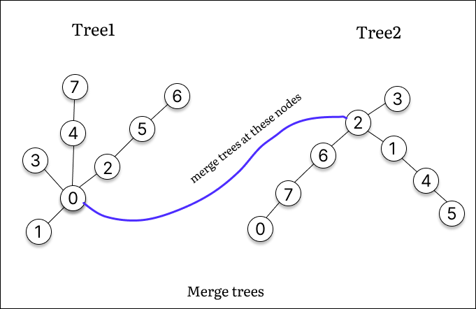
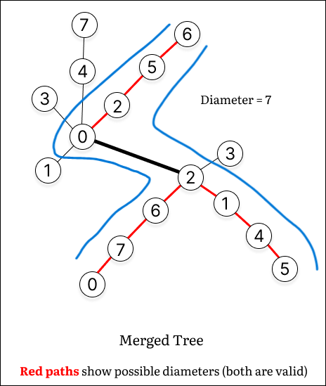

___

## [[Problem](https://leetcode.com/problems/find-minimum-diameter-after-merging-two-trees/description/)][[Code](https://github.com/AKR-2803/DSA-Declassified/blob/main/POTD-Leetcode/December/code/FindMinDiameterAfterMergingTwoTrees.java)]

<div style="text-align:left;display:inline;">  </div>

[**_`Tree`_**](https://leetcode.com/problem-list/tree/) [**_`Depth-First Search`_**](https://leetcode.com/problem-list/depth-first-search/) [**_`Breadth-First Search`_**](https://leetcode.com/problem-list/breadth-first-search/) [**_`Graph`_**](https://leetcode.com/problem-list/graph/)

> **Tip**: Solve [Leetcode 1245. Tree Diameter (Unlocked)](https://leetcode.ca/2019-04-28-1245-Tree-Diameter/) before attempting this question to gain a foundational understanding.
{: .prompt-tip }


---

## Intuition

> **Note**: This problem requires **understanding tree diameters**, which are the longest paths in a tree (undirected acyclic graph). 

To minimize the merged diameter:
- Find the diameters of the two trees.
- Connect nodes near the midpoint of each diameter to reduce the overall length effectively.

---

## Approach

### 1. Calculate the Diameter of Each Tree
- Use the **two-pass DFS** method:
  1. Perform DFS from an arbitrary node to find the farthest node (`farthest1`).
  2. From `farthest1`, perform another DFS to find the farthest node (`farthest2`).
  3. The distance between `farthest1` and `farthest2` is the tree's diameter.

```java
public int findDiameter(List<List<Integer>> adjList, int totalNodes) {
    visited = new boolean[totalNodes];
    farthestNode = adjList.get(0).get(0);
    maxDiameter = 0;

    dfs(farthestNode, 0, adjList);

    visited = new boolean[totalNodes];
    dfs(farthestNode, 0, adjList);

    return maxDiameter;
}
```

### 2. Merge the Trees
- Calculate the diameters `d1` and `d2` of tree1 and tree2.
- Connect the middle nodes of both trees to minimize the new diameter:

```java
int r1 = (int) Math.ceil((float) d1 / 2);
int r2 = (int) Math.ceil((float) d2 / 2);
int mergedDiameter = Math.max(d1, d2, r1 + 1 + r2);
```

### 3. Determine the Minimum Diameter
- The result is the maximum of the following:

```java
result = Math.max(d1, d2, r1 + 1 + r2);
```

> **Warning**: If both trees have only one node, handle the edge case where the merged diameter is `1`.

### Merging Procedure (Example)

| **Step**               | **Description**                                                                                                  |
|------------------------|------------------------------------------------------------------------------------------------------------------|
| **1. Tree1 and Tree2**    |          |
| **2. Compute Diameters**  |                                      |
| **3. Find Middle Nodes**  |                                      |
| **4. Merge Trees**        |                                      |
| **5. Final Merged Tree**        |                                      |


---

### Complexity Analysis

- **Time Complexity:_O(n + m)_** 
    - `n` and `m` are the no. of nodes in the two trees.
    - DFS is performed on each tree to calculate the diameter, and merging involves constant-time operations.

- **Space Complexity:_O(n + m)_** 
    - `O(n + m)` for storing the adjacency lists of the two trees and stack space of recursive DFS.

---

## Code

```java
class Solution {
    private boolean[] visited;
    private int maxDiameter;
    private int farthestNode;

    public int minimumDiameterAfterMerge(int[][] tree1Edges, int[][] tree2Edges) {
        return calculateMinimumDiameter(tree1Edges, tree2Edges);
    }

    public int calculateMinimumDiameter(int[][] tree1Edges, int[][] tree2Edges) {
        int n = tree1Edges.length + 1; // no. of nodes in tree1
        int m = tree2Edges.length + 1; // no. of nodes in tree2

        List<List<Integer>> adj1 = buildAdjList(tree1Edges, n);  // adjacency list tree1
        List<List<Integer>> adj2 = buildAdjList(tree2Edges, m);

        int d1 = n == 1 ? 0 : findDiameter(adj1, n);    // tree1 diameter
        int d2 = m == 1 ? 0 : findDiameter(adj2, m);

        // if both trees have only one node, the merged tree has a diameter of `1`
        if (d1 == 0 && d2 == 0) {
            return 1; 
        }

        // special case where one tree has diameter `1` and the other has diameter `0`
        if ((d1 == 1 && d2 == 0) || (d1 == 0 && d2 == 1)) {
            return Math.max(d1, d2) + 1;
        }

        // calculate the new diameter of the merged tree
        // you can also write `r1 = (d1+1)/2`
        int r1 = (int) Math.ceil((float) d1 / 2); // middle of d1 (r => radius, just for naming convention)
        int r2 = (int) Math.ceil((float) d2 / 2);

        // mergedDiameter is MAX(d1, d2, r1 + 1 + r2)
        int mergedDiameter = Math.max(d1, d2);
        mergedDiameter = Math.max(mergedDiameter, r1 + 1 + r2);

        return mergedDiameter;
    }

    // build adjacency list
    public List<List<Integer>> buildAdjList(int[][] edges, int totalNodes) {
        List<List<Integer>> adjList = new ArrayList<>(totalNodes);
        for (int i = 0; i < totalNodes; i++) {
            adjList.add(new ArrayList<>());
        }
        for (int[] edge : edges) {
            adjList.get(edge[0]).add(edge[1]);
            adjList.get(edge[1]).add(edge[0]);
        }
        return adjList;
    }

    // find the diameter of a tree using two-pass DFS
    public int findDiameter(List<List<Integer>> adjList, int totalNodes) {
        visited = new boolean[totalNodes];
        farthestNode = adjList.get(0).get(0); // arbitrary starting point
        maxDiameter = 0;

        // first DFS to find one endpoint of the diameter
        dfs(farthestNode, 0, adjList);

        // reset visited array and perform DFS from the farthest node to calculate the diameter
        visited = new boolean[totalNodes];
        dfs(farthestNode, 0, adjList);

        return maxDiameter;
    }

    // DFS to find the farthest node and track the maximum distance
    public void dfs(int node, int distance, List<List<Integer>> adjList) {
        if (visited[node]) {
            return;
        }

        visited[node] = true;
        
        if (maxDiameter < distance) {
            // keep updating the max distance and the farthest node
            maxDiameter = distance;
            farthestNode = node;
        }

        for (int neighbor : adjList.get(node)) {
            dfs(neighbor, distance + 1, adjList);
        }
    }
}
```