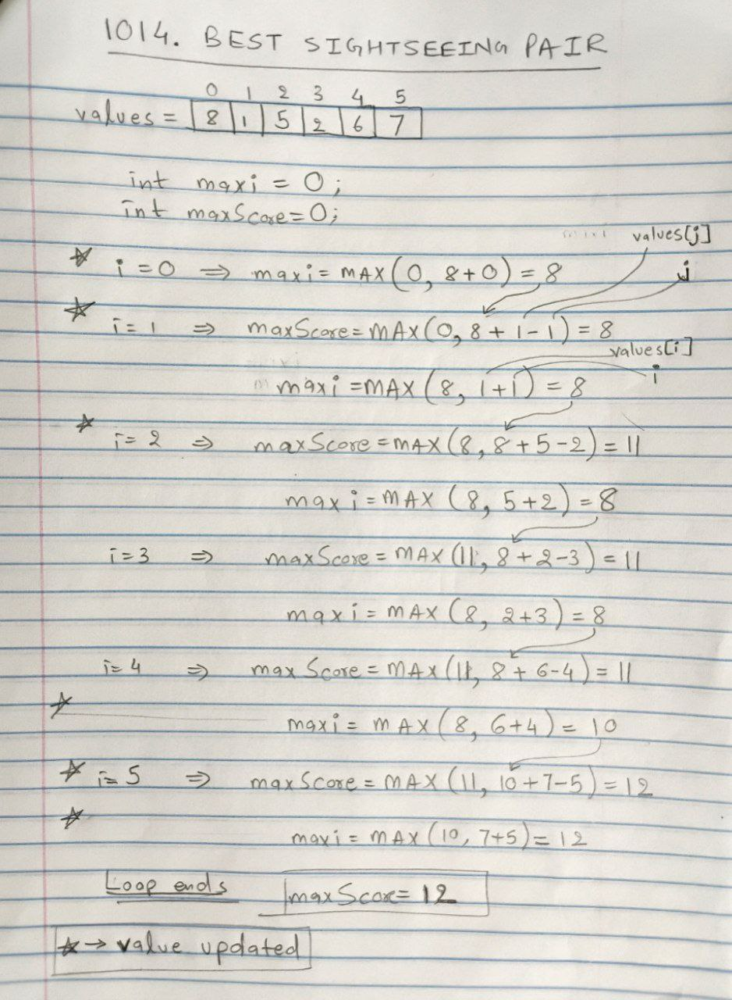

## [[Problem](https://leetcode.com/problems/best-sightseeing-pair/description/)]

 <!--   -->
  
<!--  -->

[**_`Array`_**](https://akr2803.github.io/tags/array/) [**_`Dynamic Programming`_**](https://akr2803.github.io/tags/dynamic-programming/)

---

## Intuition
- View the problem as maximizing `values[i] + i` + `values[j] - j`

## Approach

- Separate the components:
```
=> maxi = values[i] + i
=> maxScore = maxi + values[j] - j
```
- `maxi` stores maximum value for `values[i] + i`
- `maxScore` is the max score possible.

- Initialize `maxi` and `maxScore` to 0 initially.
- The **for loop**: 
    - For `i=0`, the first spot is the `ith` spot, we cannot calculate `maxScore` yet without second spot.
    - From `i=1` to `i=n-1`:
        - Keep updating `maxScore`
        ```java
        if(i > 0){
            int j = i;

            // keep updating maximum score
            maxScore = Math.max(maxScore, maxi + values[j] - j);
        }
        ```
        - Keep updating `maxi`
        ```java
        maxi = Math.max(maxi, values[i] + i);
        ```

### Complexity Analysis

- **Time Complexity: _O(n)_**  
    - Single pass through the array.

- **Space Complexity: _O(1)_**  
    - No additional space used.

### Reference Image

| Example [8,1,5,2,6,7]                                              | 
|--------------------------------------------------------------------------------------| 
|  |


### [Code](https://github.com/AKR-2803/DSA-Declassified/blob/main/POTD-Leetcode/December/code/BestSightseeingPair.java)

```java
class Solution {
    public int maxScoreSightseeingPair(int[] values) {
        return findMaxScore(values);
    }

    public int findMaxScore(int[] values){
        int n = values.length;
        int maxi = 0;
        int maxScore = 0;

        for(int i = 0; i < n; i++){
            // check for 2nd spot(jth spot)
            if(i > 0){
                int j = i; // using variable `j` for better understanding

                // keep updating maximum score
                maxScore = Math.max(maxScore, maxi + values[j] - j);
            }

            // update the ith spot when a higher value is found
            maxi = Math.max(maxi, values[i] + i);
        }
        return maxScore;
    }
}
```