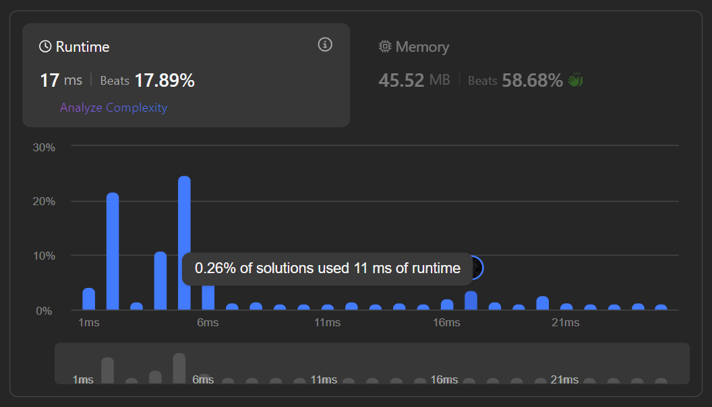
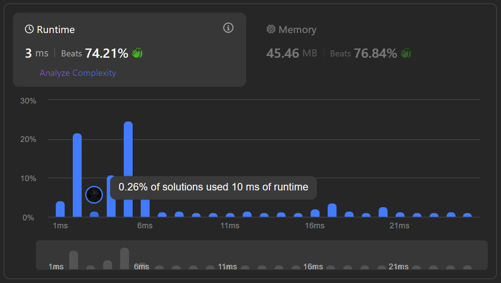
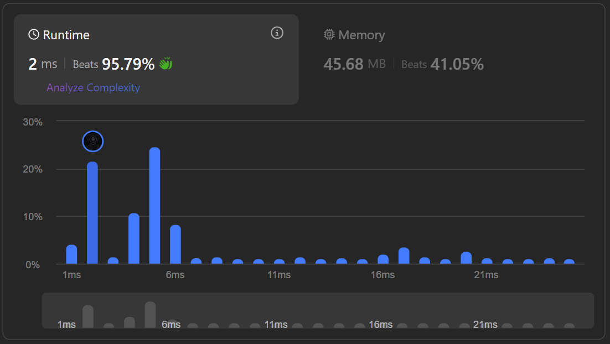

## [[Problem](https://leetcode.com/problems/find-the-prefix-common-array-of-two-arrays/description/)]

<!--   -->
  
<!--  -->

[**_`Hash Table`_**](https://akr2803.github.io/tags/hash-table/) [**_`Array`_**](https://akr2803.github.io/tags/array/) [**_`Bit Manipulation`_**](https://akr2803.github.io/tags/bit-manipulation/)

---

## Intuition

- Given two 0-indexed integer permutations `A` and `B` of length `n`, we aim to find a **prefix common array** `C`. 

- The problem essentially requires us to track common elements between the prefixes of `A` and `B` as we iterate through the arrays. The challenge lies in efficiently keeping track of these common elements.

- We know that the there are `n` elements from `1` to `n` that all appear **once**.


## Tips:

1. **Leverage the Range of Numbers**:
   - When the numbers are restricted to a specific range, such as `1 to n`, consider using **arrays** or **bit manipulation** to efficiently track and count occurrences.
   - Avoid over-complicating with data structures like `Set` unless absolutely necessary, we will discuss how the set approach works slower compared to the BitSet or Frequency array approach in this scenario.

2. **Utilize Small Constraints**:
   - Analyze the constraints carefully. For instance, in this problem:
     - **`n <= 50`**: A small constraint allows more flexibility in choosing approaches, including less optimized ones.
     - Try to use constant-sized data structures like `Arrays` work well for small ranges. 
     - A [BitSet](https://docs.oracle.com/javase/8/docs/api/java/util/BitSet.html#BitSet-int-) uses individual bits (`0` or `1`) to represent whether element is present or absent, making it memory-efficient compared to other data structures like `Set`.

3. **Optimize Space Usage**:
   - If the constraint ensures a small range, you can often replace sets or hash maps with arrays to save space and improve runtime.
   - For example, replacing a `Set` with a **frequency array** (or **BitSet** also in this case) is a common optimization.


## Approach

### 1. Using HashSet

- Maintain two sets, `setA` and `setB`, to store elements seen so far in `A` and `B`.
- At each index `i`, count the number of elements in `setA` that also exist in `setB`.
- Update the result array `C` with this count.

#### Code

```java
class Solution {
    public int[] findThePrefixCommonArray(int[] A, int[] B) {
        int n = A.length;
        int[] C = new int[n]; // result array

        Set<Integer> setA = new HashSet<>(); // track elements seen in A
        Set<Integer> setB = new HashSet<>(); // track elements seen in B

        for (int i = 0; i < n; i++) {
            setA.add(A[i]); // add current element from A to setA
            setB.add(B[i]); // add current element from B to setB

            int common = 0; // counter for common elements

            // count common elements between setA and setB
            for (int elemA : setA) {
                if (setB.contains(elemA)) {
                    common += 1;
                }
            }

            C[i] = common;
        }
        return C; 
    }
}
```

### 2. Using BitSet

- Use a `BitSet` to efficiently track the presence of elements.
- Represent elements from `A` and `B` using specific bit positions: odd for `A[i]` and even for `B[i]`.
- Check if the bits are set and increment `common` accordingly.
- [More about BitSet](https://docs.oracle.com/javase/8/docs/api/java/util/BitSet.html#BitSet-int-)


#### Index Mapping

- For an element `x`:
    - **Odd index  (`2 * x - 1`)**: Tracks if `x` has been seen in array `A`.
    - **Even index (`2 * x`)**: Tracks if `x` has been seen in array `B`.
    
- This mapping creates a predictable pattern for bit positions, as shown below:

| Element (x) | Bit Index for `A` (2x-1) | Bit Index for `B` (2x) |
|---------------|----------------------------------|-----------------------------|
| 1             | 1                                | 2                           |
| 2             | 3                                | 4                           |
| 3             | 5                                | 6                           |
| 4             | 7                                | 8                           |
| ...           | ...                              | ...                         |

- An example is below

```
For e.g. 
                 A1  B1  A2  B2  A3  B3  A4  B4
index    =>   0   1   2   3   4   5   6   7   8   
bitset   =>   0   1   1   1   0   1   0   1   1


A1 : 1 in array A  |  B1 : 1 in array B
A2 : 2 in array A  |  B2 : 2 in array B


=> Interpretation: If bit at B2(index 4) is `0` means 2 has NOT been seen in the array `B`, vice-versa for `1`.  
```

- Dry running an example:

```
For `A = [1, 2, 3]` and `B = [3, 1, 2]`:

Start 
------------------------------------------------
i=0
  
  - `A[0] = 1`: Set bit `1` (odd).
  - `B[0] = 3`: Set bit `6` (even).
------------------------------------------------

i=1
  - `A[1] = 2`: Set bit `3` (odd).
  - `B[1] = 1`: Set bit `2` (even); bit `1` (odd) is already set (common element).

------------------------------------------------

i=2
  - `A[2] = 3`: Set bit `5` (odd); bit `6` (even) is already set (common element).
  - `B[2] = 2`: Set bit `4` (even); bit `3` (odd) is already set (common element).

------------------------------------------------

Output
C = [0, 1, 3]
```

#### Code

```java
class Solution {
    public int[] findThePrefixCommonArray(int[] A, int[] B) {
        int n = A.length;
        int[] C = new int[n]; // result array

        // BitSet to track seen elements (size 2*50 + 1), constraints specify max length is 50
        BitSet bs = new BitSet(101); 

        int common = 0; // counter for common elements

        for (int i = 0; i < n; i++) {
            int aa = A[i]; // current element from A
            int bb = B[i]; // current element from B

            // mark A[i] in BitSet (odd index)
            bs.set((2 * aa) - 1);
            if (bs.get(2 * aa)) { // check if B[i] already set
                common++;
            }

            // Mark B[i] in BitSet (even index)
            bs.set(2 * bb);
            if (bs.get((2 * bb) - 1)) { // check if A[i] already set
                common++;
            }

            C[i] = common;
        }
        return C;
    }
}
```


### 3. Using Frequency Array

- Use a frequency array to count occurrences of elements in both `A` and `B`.
- Whenever an element's frequency becomes 2 (it means that element appeared in both arrays), increment `common`.

#### Code

```java
class Solution {
    public int[] findThePrefixCommonArray(int[] A, int[] B) {
        int n = A.length;
        int[] C = new int[n]; // result array
        int[] freq = new int[n + 1]; // frequency array to track element occurrences

        int common = 0; // counter for common elements

        for (int i = 0; i < n; i++) {
            // increment frequency for A[i]
            freq[A[i]]++;
            if (freq[A[i]] == 2) { // element appears in both arrays
                common++;
            }

            // increment frequency for B[i]
            freq[B[i]]++;
            if (freq[B[i]] == 2) { // element appears in both arrays
                common++;
            }

            C[i] = common;
        }
        return C;
    }
}
```


### Complexity Analysis

| Approach                 | Time Complexity | Space Complexity | Runtime |
|--------------------------|-----------------|------------------|---------|
| [**Using Set**](https://akr2803.github.io/posts/find-prefix-common-array-of-two-arrays/#1-using-hashset)  | O(n²)          | O(n)            |      |
| [**Using BitSet**](https://akr2803.github.io/posts/find-prefix-common-array-of-two-arrays/#2-using-bitset)  | O(n)           | O(1)            |       |
| [**Using Frequency Array**](https://akr2803.github.io/posts/find-prefix-common-array-of-two-arrays/#3-using-frequency-array) | O(n)           | O(n)            |      |


### [Full Code](https://github.com/AKR-2803/DSA-Declassified/blob/main/POTD-Leetcode/January/code/FindPrefixCommonArrayOfTwoArrays.java)


```java
class Solution {
    public int[] findThePrefixCommonArray(int[] A, int[] B) {
        // uncomment the approach you want to use
        // return usingSet(A, B);b
        // return usingBitSet(A, B);
        return usingFrequencyArray(A, B);
    }

    // approach 1: Using Set
    private int[] usingSet(int[] A, int[] B) {
        int n = A.length;
        int[] C = new int[n]; // result array

        Set<Integer> setA = new HashSet<>(); // track elements seen in A
        Set<Integer> setB = new HashSet<>(); // track elements seen in B

        for (int i = 0; i < n; i++) {
            setA.add(A[i]); // add current element from A to setA
            setB.add(B[i]); // add current element from B to setB

            int common = 0; // counter for common elements

            // count common elements between setA and setB
            for (int elemA : setA) {
                if (setB.contains(elemA)) {
                    common += 1;
                }
            }

            C[i] = common;
        }
        return C; 
    }

    // approach 2: using BitSet
    private int[] usingBitSet(int[] A, int[] B) {
        int n = A.length;
        int[] C = new int[n]; // result array

        // BitSet to track seen elements (size 2*50 + 1), constraints specify max length is 50
        BitSet bs = new BitSet(101); 

        int common = 0; // counter for common elements

        for (int i = 0; i < n; i++) {
            int aa = A[i]; // current element from A
            int bb = B[i]; // current element from B

            // mark A[i] in BitSet (odd index)
            bs.set((2 * aa) - 1);
            if (bs.get(2 * aa)) { // check if B[i] already set
                common++;
            }

            // Mark B[i] in BitSet (even index)
            bs.set(2 * bb);
            if (bs.get((2 * bb) - 1)) { // check if A[i] already set
                common++;
            }

            C[i] = common;
        }
        return C;
    }

    // approach 3: using frequency array
    private int[] usingFrequencyArray(int[] A, int[] B) {
        int n = A.length;
        int[] C = new int[n]; // result array
        int[] freq = new int[n + 1]; // frequency array to track element occurrences

        int common = 0; // counter for common elements

        for (int i = 0; i < n; i++) {
            // increment frequency for A[i]
            freq[A[i]]++;
            if (freq[A[i]] == 2) { // element appears in both arrays
                common++;
            }

            // increment frequency for B[i]
            freq[B[i]]++;
            if (freq[B[i]] == 2) { // element appears in both arrays
                common++;
            }

            C[i] = common;
        }
        return C;
    }
}
```